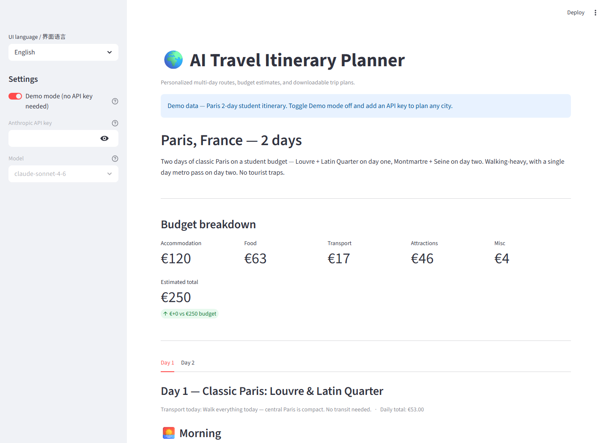

# AI Travel Itinerary Planner / AI 旅行行程规划器

## Overview / 项目简介

AI Travel Itinerary Planner is a Streamlit app that generates multi-day travel plans from a few inputs: city, trip length, budget, interests and language. It includes a demo mode with a pre-built Paris itinerary, so the UI can be tested without an API key.

AI 旅行行程规划器是一个 Streamlit 项目。用户输入城市、天数、预算、兴趣和语言后，应用会生成多天行程、预算拆分、餐厅建议、交通提示和 PDF 下载。项目内置巴黎行程 demo，不配置 API key 也可以体验主要界面。

## Why I Built This / 项目背景

I built this as a portfolio project to practise LLM application structure in Python: prompt design, schema validation, UI rendering and PDF export. The original use case was planning budget-friendly weekend trips for students in Europe.

这个项目是我用 Python 练习 LLM 应用结构时做的作品集项目，重点包括 prompt 设计、结构化输出校验、Streamlit 页面展示和 PDF 导出。最初的场景是为学生规划欧洲周末低预算旅行。

## My Contributions / 我的工作

- Built the Streamlit UI with English and Chinese interface text.
- Implemented demo mode with a fixed Paris itinerary for offline testing.
- Designed Pydantic models for itinerary, day plan, places, meals and budget breakdown.
- Built prompt templates for structured itinerary generation.
- Added Anthropic API integration for live itinerary generation.
- Implemented PDF export with ReportLab.
- Added Google Maps links and rainy-day alternatives in the rendered plan.

- 使用 Streamlit 搭建双语界面。
- 实现 demo 模式，使用固定巴黎行程支持无 API key 演示。
- 设计 Pydantic 数据模型，覆盖行程、每日计划、地点、餐食和预算拆分。
- 编写结构化行程生成 prompt。
- 接入 Anthropic API，用于实时生成行程。
- 使用 ReportLab 实现 PDF 导出。
- 在页面中展示 Google Maps 链接和雨天备选方案。

## Tech Stack / 技术栈

- Python
- Streamlit
- Anthropic SDK
- Pydantic v2
- ReportLab
- python-dotenv

## Features / 主要功能

- Demo mode with a Paris student itinerary.
- Live itinerary generation when an Anthropic API key is provided.
- Inputs for city, days, budget, interests and student mode.
- English and Simplified Chinese UI.
- Structured day-by-day plan with morning, lunch, afternoon, dinner and evening sections.
- Budget breakdown and comparison with the user's budget.
- PDF export for the generated itinerary.

## Results / 项目成果

The app can run locally without external credentials in demo mode. With an API key, it can request a new itinerary and validate the model output before rendering it. The project demonstrates a complete small LLM workflow: input form, prompt construction, schema validation, UI rendering and export.

项目可以在 demo 模式下本地运行，不需要外部密钥。配置 API key 后，可以生成新的行程，并在展示前用 Pydantic 校验模型输出。这个项目展示了一个小型 LLM 应用的完整流程：输入表单、prompt 构造、结构校验、页面渲染和文件导出。

## How to Run / 如何运行

```bash
pip install -r requirements.txt
streamlit run app.py
```

Open the local Streamlit URL shown in the terminal. Demo mode is enabled by default.

Optional `.env`:

```bash
ANTHROPIC_API_KEY=
```

You can also paste the key in the sidebar for the current session only.

也可以直接在侧边栏输入 API key，仅在当前会话中使用。

## Screenshots / Results Preview



## Limitations / 当前限制

- The app is a planning helper, not a booking engine.
- It does not query live hotel, flight, restaurant or availability data.
- Place suggestions depend on the model response or the built-in demo itinerary.
- Budget numbers are estimates and should be checked before travelling.

## Future Improvements / 后续改进

- Add tests for Pydantic validation and prompt parsing.
- Add a screenshot gallery to the README.
- Add optional live place data if a suitable API is configured.
- Save generated itineraries locally for comparison.
- Improve PDF layout for longer trips.

## What I Learned / 我的收获

This project helped me practise controlling LLM output with schemas. The most important lesson was to validate model responses before they reach the UI, because even a good prompt can return an unexpected shape.

这个项目让我练习了如何用数据模型约束 LLM 输出。最大的收获是：即使 prompt 写得比较清楚，也需要在进入 UI 前做结构校验，否则页面很容易被不稳定输出影响。

## License / 许可证

MIT. See [LICENSE](LICENSE).
